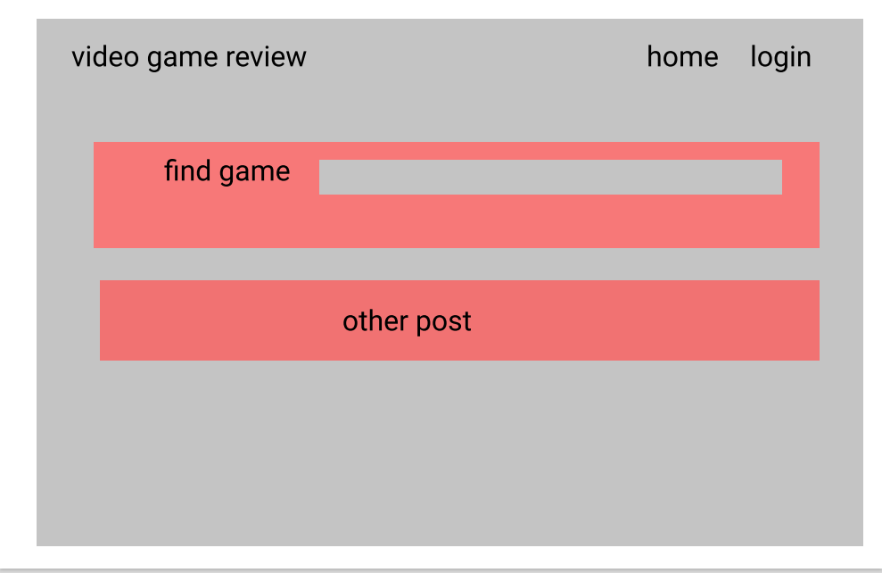
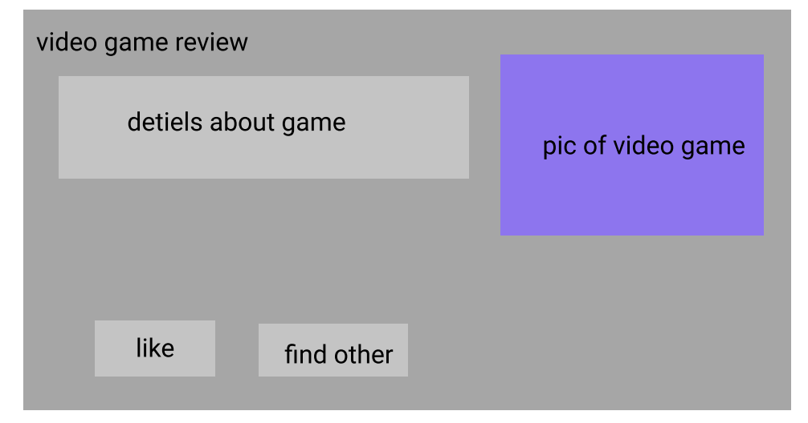

# VideoGameReviewer
An app where users can sign up to post and comment on their favorite games!

## Welcome to your very own Video Game Blog!

* Our setup is nice, simple, and comfortable for users to make comments on there
favorite games. 

### Recommending Games?

* Users have a chance to personally have input on why there favorite games should be
played by other people.

* Our users will have a chance to trade ideas on what games the other might love.

* This is a great way to connect gamers from all around the world in a safe space
to talk about games.

### Making Reviews?

We have a great experience to make all of our users with the ability to make 
reviews on all of your favorite games.

## Tech used
* express-handlebars
* express   
* axios
* bcrypt
* connect-session-sequelize 
* dotenv
* express-session
* mysql2
* sequelize

## Installion
make sure you have node.js already installed also you will need to install sequelize:

```
npm i sequelize
```
and mysql2

```
npm i mysql2
```

and dotenv

```
npm i dotenv
```

and express.js, the session and handlebars
```
npm i express express-session express-handlebars
```
and axios, bcrypt, connect-session-sequelize
```
npm i axios bcrypt connect-session-sequelize
```


## Wireframe





## Screen shot of landing page


## API's:

* https://api.rawg.io/docs/
* https://bulma.io/documentation/

## Link to Deployed App
https://video-game-reviewer.herokuapp.com/